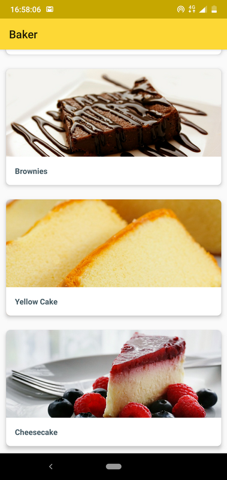
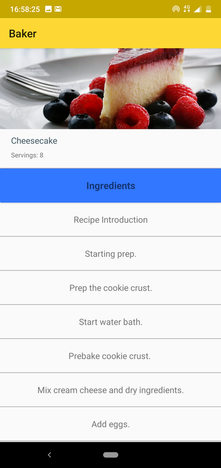
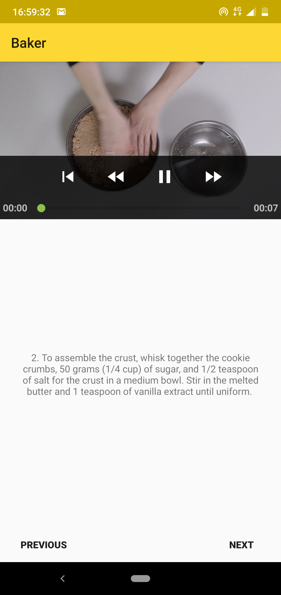

# Baker-and
Baker app shows the recipes of foods with video tutorials from a server. This app uses various libraries like Exoplayer, Glide etc.. This my end lesson project exercise in Android Developer Nanodegree by Google from Udacity which I got as a part of Google India Challenge Scholarship 2018 

  
